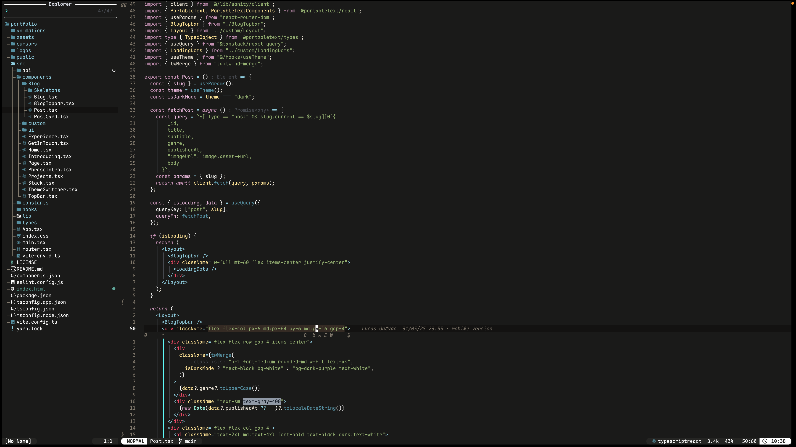

# Maple.nvim

A warm, autumn Neovim colorscheme with some pastel colors. Soft to the eyes if you enjoy long coding hours.
Features include:

- Elegant pastel palette with calm colors
- Optional transparent background for seamless integration with your terminal
- Built-in Lualine theme support

<p align="center">
  
</p>

## Installation

Using your plugin manager (example for lazy.nvim):

```lua
{
  "lucasgalvao/maple.nvim",
  config = function()
    require("colors.maple").setup()
  end
}
```

Then in your init.lua:

```
vim.cmd("colorscheme maple")
```

If you wanna also use the lualine theme:

```
require("maple.lualine")
```

The theme also supports transparency and italic. To enable, just pass the properties into the setup call:

```
require("colors.maple").setup({ transparency = true, italic = true })
```

Feel free to open issues or PR's!
